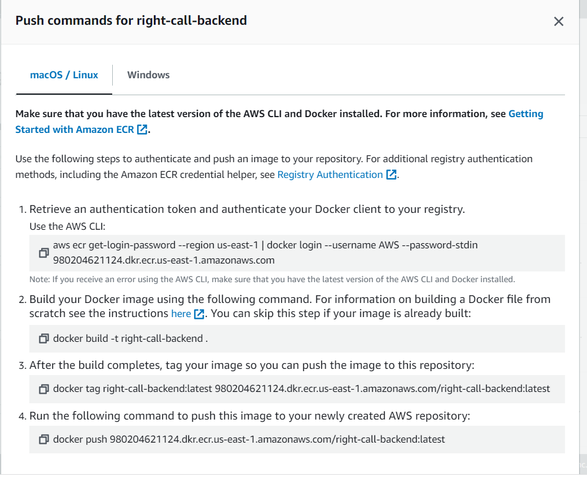
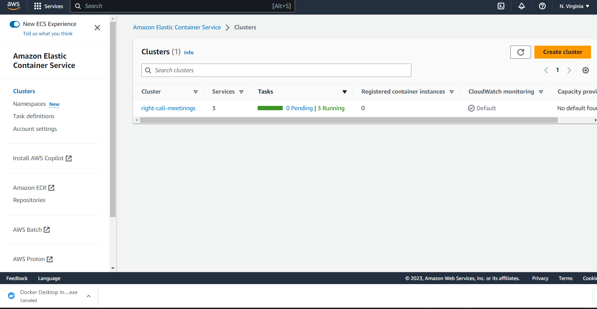
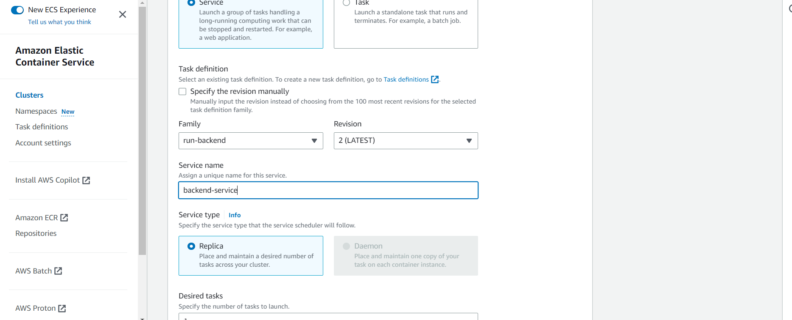
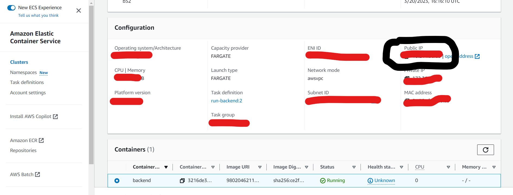

# Deployment
## Servers needed
The web and api are both node servers. They can run on any system that can run node.

## Deploying Site to AWS
1. Navigate to AWS Elastic Container Registry
2. For the Backend images, click the Push Commands button and run them locally in the  api folder for the backend.

3. Once the images are pushed to AWS, the rest can be done through AWS UI. Navigate to Elastic Container Service. There should be an Instance named Right-Call-Meetinngs. Select it.

4. Go to the Task tab. Select Run New Task.

5. Run the Backend First. Select the task definination called "Backend-task", make sure the definition refers to the (latest) image. Run Service.

6. Navigate to the task that is now running. Copy the public IP adress.

7. In the Web Directory's .env file, replace 'localhost:3000' with the copied IP adress. In the host and the VUE_APP_BACKEND_URL.

8. Repeat steps 2-6 again with the frontend image.

9. The website should be accessible by the Frontend Task's IP, see step 6.

## Where to deploy files locally
For the web app, navigate to the web folder, then use  
>npm run serve 

This will run the web app, and serve up the home page at the url the deployment app tells.

For the API, navigate to the api folder, then use  
>npm start 

This will run the node server , and it will await requests.

## Stop system
Thes servers can easily stopped by pressing (Ctrl + C) on the terminal running the proccess. This will send the kill command and stop the service.

## Troubleshooting Deployment
The most common mistake made in deployment is note connecting the multiple services together properly. 

## Debugging on live server
Any error on the system while it is running, will be logged at the terminal of the api. While it is running, a stacktrace will appear with any caught errors.