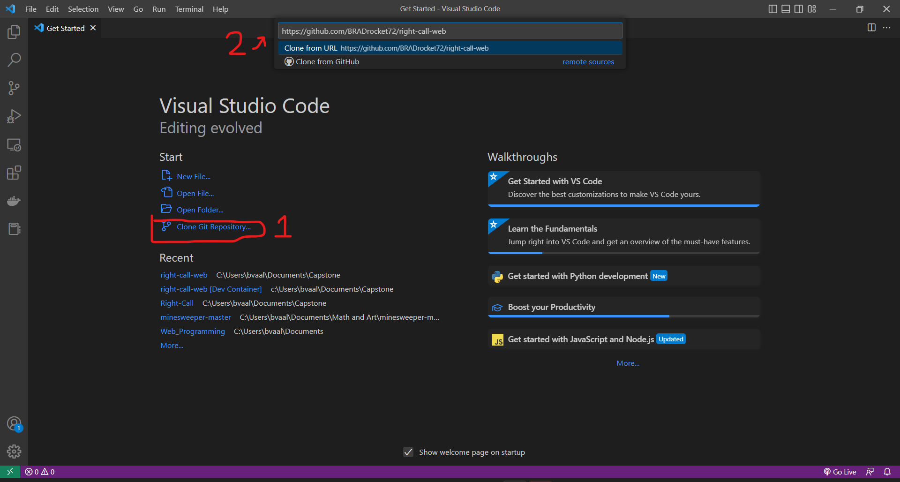

# Development
## Source Code
The source code for this project is located at: 
 <a href="https://github.com/BRADrocket72/right-call-web">https://github.com/BRADrocket72/right-call-web</a>

 You can download the zip file, or open it through an IDE. To open it through visual studio code: 
 1. Open a new VSCode Window and click on Clone Git Repository
 2. Paste URL from above into the commant pallete

 The repository should pull down the code from the main branch. 

 ## Rules for Pull Requests
 For any new features, they must be made on their own branch. When the feature is complete, please go to github, and create a Pull request into the main branch. At least one other developer must apporve the request before it is merged in.

## Suggested IDE
-  Microsoft Visual Studio Code 

## Project Structure
This project is written in two distinct elements.
- The Presentation layer will be in the web folder. All visual frontend code will be based in this folder.This will primarily be written in Vue and Typescript.

## Starting the Front End
1. The most important package is Node.js, this will be used to download most of the other dependencies. The download link is https://nodejs.org/en/download/

2. To acquire the rest of the dependencies for this project, open up the repository folder in VScode.

3. Now we need to open up a terminal to install dependencies for the front end

>`cd web` 
`npm install`

4. Now that all of our dependencies are installed we can run the web page. 
By running: 
>`npm run serve`

The home page will be avaialble at localhost:8080. View it in your browser 
- If there are any dependencies that are missing, make sure to run npm install "package name"

## Running Tests
This project uses Jest as a testing framework. All tests can be run through npm.
 ### For Unit Tests
 1. Set web as your current directory in the terminal
 2. Run the command  
 >`Npm run test:unit` 
 3. All tests will run and the output will be placed in the console.

## Writing Tests
Sample Test
 
1. Give the test suite the name of the the component you are testing. In this case, it is VideoEditor.vue
2. In the beforeEach, mount your component. This means that each test will have a component in the dom to test. Mount is needed to test children component, but it is often better to shallowMount to increase test speed
3. Write your test case. In the it() write the actions that your test will be taking, and at the end expect a value.

Try to write a test for every function a component has. Try to be as comprehensive as possible.