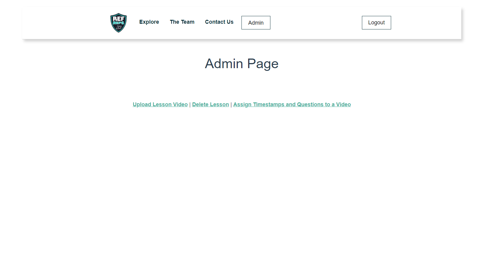

# Ref Reps User Manual
This is the documentation that guides a user on how to use the Ref-Reps Right call Application

## Navigation
- Currently the navigation bar at the top, is for visual purposes only. 

## Select Lesson
- There are a group of lessons available at the homepage to select from.
- Select a lesson by clicking on a lesson object.

## Completing a Lesson

- After selecting a lesson, the user is shown a video file.
- To start a lesson the user must play the video by pressing the play button.
- The current time of the video is displayed beneath the video player along with the length of the video.

## Make a Call

- During a lesson, there will be a number of questions that appear while the user is watching the video file.
- The user should select what they believe is the right referee call.
- After selecting an answer, the user should press the play button again and resume the video until either the next question pops up or the video ends.

## Lesson Results

- At the end of a Video, a Lesson results pop-up will appear.
- This Lesson results pop-up includes the % of right and wrong calls that a user has made during the lesson.
- The lesson results pop-up includes the title of each question that asked while watching the video, and if they were answered correctly or incorrectly.
- After viewing the results, the user should press the "Back to Lesson Selection Page" button which sends them back to the original page to select another video.

## Register for the Website

- If one does not have an account, they are can go to the Register Page from the Login Page.
- User can create a username and password for the use of the website.
- User can also register as a student, instructor, or admin.
- Once all boxes are filled, they hit the register button and if successful, it will direct them back to the Login Screen.

## Login to The Website

- If one is already registered, they can enter their username and password to login into their account in the text fields provided.
- If the account exists, they will be directed to their respective page based on if they registered as student, instructor, or admin.
- If the account does not exist, they will remain on the Login Page with a message saying "Invalid Username or Password".

## Upon Logging In

-

