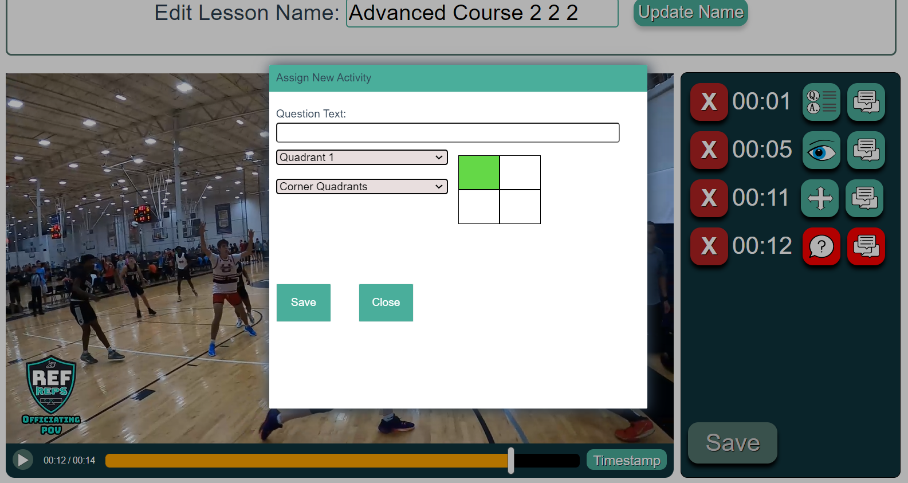
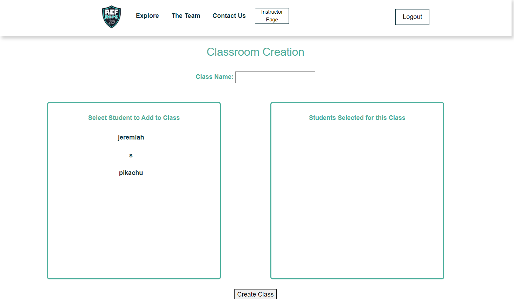
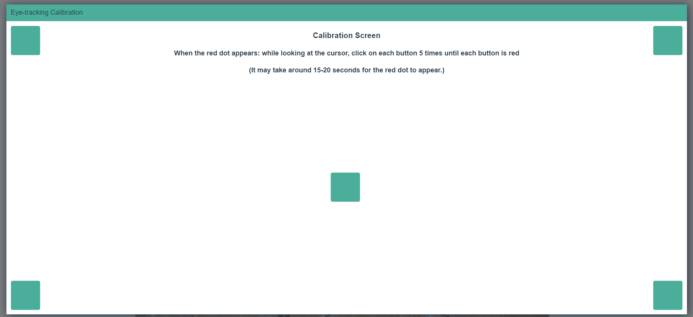

# Ref Reps User Manual
This is the documentation that guides a user on how to use the Ref-Reps Right call Application

## Navigation
- Currently the three links: 'Explore', 'The Team', and 'Contact Us' on the navigation bar at the top of the application is for visual purposes only. 
- For when a student is logged in, clicking the RefReps logo at the top left will redirect them back to the lesson selection page where they can take another quiz. 

## Register for the Website

- If the user does not have an account, the user can go to the Register Page from the Login Page by clicking on the register button at the top right of the page.
- User must enter an email, and create a username and password for the use of the website.
- User can also register as a student, instructor, or admin.
- Student role: can take the quizzes.
- Admin role: allows you to upload and delete videos, and add questions at specific timestamps to each video.
- Instructor role: can create classes and add students to their classes. Can also add/remove videos to each class for their students to take. They also can alter and add their own questions to timestamps for each video added by the admin.
- Once all boxes are filled, the user hits the register button and if successful, it will direct them back to the Login Screen for them to now login.

## Login to The Website

- If one is already registered, they can enter their username (or email) and password to login into their account in the text fields provided.
- If the account exists, they will be directed to their respective page based on if they registered as student, instructor, or admin.
- If the account does not exist or the username or password is incorrect, they will remain on the Login Page with a message saying "Invalid Username or Password".

# Upon Logging In
## Admin Logged In

- If an admin logs in, they will have three options to choose from. They could either upload a lesson video, delete the lesson video, or assign questions/activities at specific timestamps to a lesson.
- The admin can click the Admin button at the top of the screen to go back to the main admin page after doing any of the three actions.

## Uploading Videos

- If the admin selects the Upload Lesson Video link, the admin will be redirected to the upload video page. 
- To upload a video, the user would click on the select video button, and then they would select a video file from their computer.
- For the video input, there are three supported types of videos that can be uploaded: MP4, WebM, and Ogg.
- Once selected, they would then click upload and if it works, it would direct them back to the admin page and a lesson would succesfully be created.
- A message will appear to let the admin know the video is still uploading.
- The video may take a little bit (around 10 seconds) to upload, so don't click upload again or anything else until redirected back to the admin page. 

## Deleting Videos/Lessons

- If the admin selects the Delete Lesson link, the admin will be redirected to the delete lesson page. 
- All lessons would appear on the admins screen that they have access to/created.
- If the user wants to delete a lesson, they would click on the lesson.
- A popup would then appear asking if they would like to delete that specific video. If they click yes, the video would be erased and if they click no, it would direct them back to their previous page.

## Adding Timestamps/Questions/Feedback to Existing Lessons

- If the admin selected the Assign Timestamps and Question to a video link, the admin can see what lessons they have created and like the deletion page, they can click on the lesson they wish to edit.

- The User would be taken to a Lesson Creation page where they can add timestamps to the video they uploaded and cannot save/upload the lesson until they attach a question to it.

- User would click the "Add Timestamp Here" button to save a timestamp where that timestamp would then appear in a menu above the big button with an additional option to add an activity.
- The user cannot save/upload the timestamp until each timestamp has a filled out question attached to it.

- The User then clicks on "Activity", and would be able to insert a question and possible answer choices, including selecting the correct answer, in the text fields provided before saving. 
- The User has the option of creating a multiple choice, short answer, or Eye Tracking question.

- The short answer and multiple choice questions are how they sound: if a user chooses the short answer, they just add one answer choice, and if a user chooses the multiple choice, they must add a minimum of two answer choices and max of four.

- For the eye-tracking question, you can write the question, and then choose the quadrant of the screen the student should be looking at. 
- On the "Assign New Activity" popup, the user must click the save button if they wish to attach the question to the timestamp. Clicking close would not add the question to the timestamp, and the admin would need to add the question again.
- Once finished adding questions and timestamps, the User can click the "Save" button at the bottom left corner of the timestamps and activities list which will upload the timestamps and questions and redirect the user back to the page where they can select lessons to add timestamps to.
- If the user is done editing lessons, they can click the Save button to go back to the main admin page.

- Drag and Drop questions let the user drag the options exactly where they want on top of the video. An image of the video frame from the Activity's timestamp will be displayed, and input options or number options can be dragged on top. 
- Once inputs are dragged onto the picture, they can be typed in to establish their value during the actual quiz. Any option, number or text, can be deleted by clicking the red X. All of the inputs of a certain type can be reset by clicking its respective Reset button. If you have numbers 1-4 dragged onto the picture, and delete one of them, all numbers that are higher than the deleted number will decrement to keep the proper order.

## Instructor Logged In

- When an instructor logs in, their middle button on the instructor page is to edit the current lessons already uploaded by the admins. 
- Clicking on a lesson would send them to the exact same assign timestamps and questions to the lesson page as the admin.
- They can add questions to timestamps and the page operates identically to the admin's assign timestamps and questions page that has been described in detail above in the admin instructions.
- The instructor can just click the Instructor Page button at the top of the screen to go back to their home page where they can select what they want to do.

- When the instructor chooses the Create Classroom Page button, they are directed to the Classroom Creation page.
- The Instructor must enter a class name.
- Then, they can select students from the left column of students to add to their class. 
- Any students they click on will show up in the column to the right of Selected Students. 
- When the instructor is done adding students, they must click the Create Class button to officially create the class. 

- After creating a class, they are back on the instructor page, and then the instructor can click the Update Class option. 
- On this page, they can see all of the classes they have created, along with the number of students and videos in the class.
- The instructor can add/remove students to and from the class, and they can also add/remove videos to the class. 

- Instructor can select the Add/Remove Students button.
- The instructor sees all available students, and can either click a student from the top section to remove from the class or a student from the bottom section to add to the class.

- Instructor can select the Add/Remove Lessons button.
- Here they can see all available videos/lessons they can add to the class.
- Right now there are zero videos in the class, to add one, the instructor can just click a video from the bottom section.
- To remove a video from the class, the instructor must select a video from the top section.
- All students can only take video quizzes that are assigned to the classes they are in.

## Student Logged In

## Select Lesson

- There are a group of lessons available at the homepage to select from.
- A new student may not have any lessons to choose from, because they may not be added to a class by an intructor yet.
- Students can only take lessons that are assigned to the classes they are in. If they are in multiple classes and the classes have the same video assigned, the student only sees that video once. 
- Select a lesson by clicking on a lesson object.

## Completing a Lesson

- After selecting a lesson, the user is asked if they want to use their camera for eye-tracking questions. 

- If they select decline, the user is shown a video file.
- To start a lesson the user must play the video by pressing the play button.
- The current time of the video is displayed beneath the video player along with the length of the video.

## Make a Call

- During a lesson, there will be a number of questions that appear while the user is watching the video file.
- The user should select what they believe is the right referee call.
- After selecting an answer, the video should automatically resume and play until the next question pops up or the video ends.

- One type of question that may pop up is this one, where it asks the student a question and the student must select the quadrant of the video screen where they think the answer to the video is/occurred. 

- If the student selects accept to use their webcam, they are sent to the eye-tracking calibratiom page.
- This page is only completed once per login session.
- The student must wait around 5-10 seconds for the red dot to show up on their screen. Once it displays, the student must click all five buttons five times each until each one is red. 
- After that, select the button in the middle that shows up.
- The student is sent back to the video, and they can press play and start the quiz.
- Questions can show up at any timestamps. 

- An eye-tracking quesiton may show up, and the student must look at the quadrant of the screen they think the answer is in.
- A screen will display after the question to say if the student looked at the right part of the screen.

## Lesson Results

- At the end of a video, a lesson results pop-up will appear.
- This Lesson results pop-up includes the % of right and wrong calls that a user has made during the lesson.
- The lesson results pop-up includes the title of each question that asked while watching the video, and if they were answered correctly or incorrectly.
- After viewing the results, the user should press the "Back to Lesson Selection Page" button which sends them back to the original page to select another video.

## View Student's Results

- The student can click on the View Results button at the top of the screen to view the results to all of the lessons they have taken.
- To take another quiz, the student must click the refreps logo image at the top left of the screen, which will take them back to the lesson selection page.