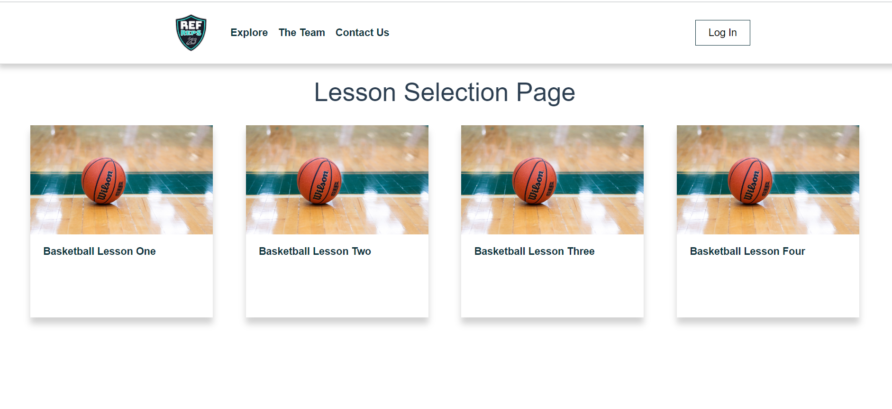

# Ref Reps User Manual
This is the documentation that guides a user on how to use the Ref-Reps Right call Application

## Navigation
- Currently the navigation bar at the top, is for visual purposes only. 

## Select Lesson
- There are a group of lessons available at the homepage to select from.
- A general overview of a lesson is described in each lesson object.
- Select a lesson by clicking on a lesson object.

## Completing a Lesson

- After selecting a lesson, the user is shown a video file.
- To start a lesson the user must play the video.

## Make a Call

- During a lesson, there will be a number of questions that appear while the user is watching the video file.
- The user should select what they believe a right referee call.

## Lesson Results

- At the end of a Video, a Lesson result popup will appear.
- Lesson results includes the % of right and wrong calls that a user has made during the lesson.
- Lesson results includes the title of each question that asked while watching the video, and if they were answered correctly or incorrectly.
- Lesson results also includes a button that links a user back to the Lesson Selection Page.