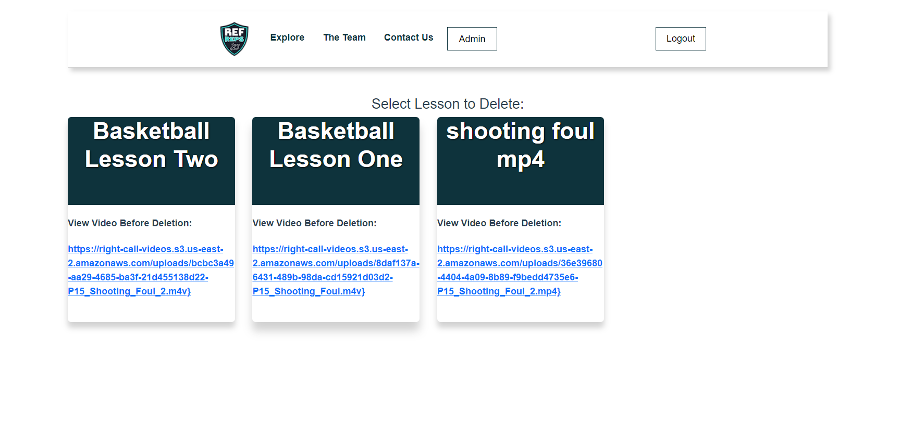

# Ref Reps User Manual
This is the documentation that guides a user on how to use the Ref-Reps Right call Application

## Navigation
- Currently the navigation bar at the top, is for visual purposes only. 

## Select Lesson
- There are a group of lessons available at the homepage to select from.
- Select a lesson by clicking on a lesson object.

## Completing a Lesson

- After selecting a lesson, the user is shown a video file.
- To start a lesson the user must play the video by pressing the play button.
- The current time of the video is displayed beneath the video player along with the length of the video.

## Make a Call

- During a lesson, there will be a number of questions that appear while the user is watching the video file.
- The user should select what they believe is the right referee call.
- After selecting an answer, the user should press the play button again and resume the video until either the next question pops up or the video ends.

## Lesson Results

- At the end of a Video, a Lesson results pop-up will appear.
- This Lesson results pop-up includes the % of right and wrong calls that a user has made during the lesson.
- The lesson results pop-up includes the title of each question that asked while watching the video, and if they were answered correctly or incorrectly.
- After viewing the results, the user should press the "Back to Lesson Selection Page" button which sends them back to the original page to select another video.

## Register for the Website

- If one does not have an account, they are can go to the Register Page from the Login Page.
- User can create a username and password for the use of the website.
- User can also register as a student, instructor, or admin.
- Once all boxes are filled, they hit the register button and if successful, it will direct them back to the Login Screen.

## Login to The Website

- If one is already registered, they can enter their username and password to login into their account in the text fields provided.
- If the account exists, they will be directed to their respective page based on if they registered as student, instructor, or admin.
- Note: Admin option is only temporary.
- If the account does not exist, they will remain on the Login Page with a message saying "Invalid Username or Password".

## Upon Logging In

- Those logged in as a student, will be taken to the lesson selection screen as seen earlier in this dicumentation.
- Any other will be directed to the admin page (both admin page and instuctor page would be very similar with the only difference being that admins can't upload videos).

## Uploading Videos

- To upload a video, the user would click on the select video button, and then they would select a video from their computer.
- Once selected, they would then click upload and if it works, it would direct them back to the user page and a lesson would succesfully be created.
- If not, an error message would appear.

## Deleting Videos/Lessons

- All lessons would appear on the users (admin/instructor) screen that they have access to/created.
- If the user wants to delete a lesson, they would click on the lesson.
- A popup would then appear asking if they would like to delete that specific video. If they click yes, the video would be erased and if they click no, it would direct them back to their previous page.

## Adding Timestamps to Existing Lessons

- The admin/instructor can see what lesson s they had created and like deletion, they can click on the lesson they wish to edit.
- The User would be taken to a Lesson Creation page where they can add timestamps to the video they uploaded to the lesson and even attach an activity (only multiple choice questions) to the video.
- User would click the "Add Timestamp Here" button to save a timestamp where that timestamp would then appear in a menu above the big button with an additional option to add an activity.
- The User that clicks on "Add Activity" would be able to insert questions and possible answers, including selecting the correct answer, in the text fields provided before saving.
- Once finished, the User can click the "Save" button which will give them the option to take them back to the Lesson Selection screen for further editing other lessons or continue working on the same one.

