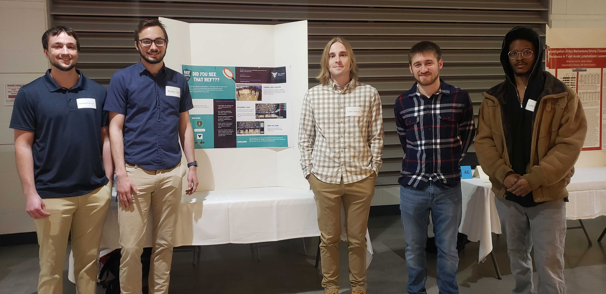
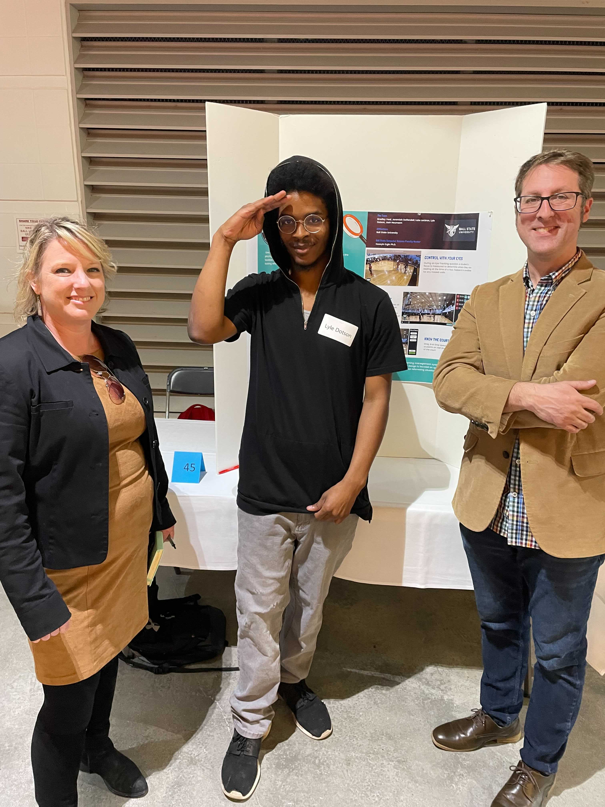
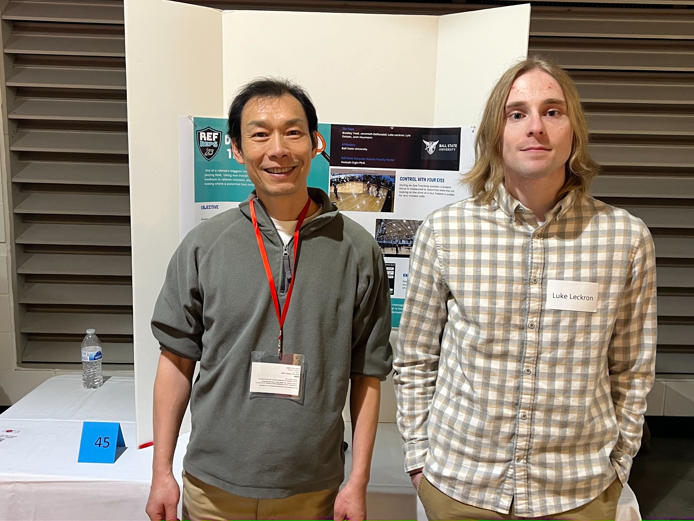
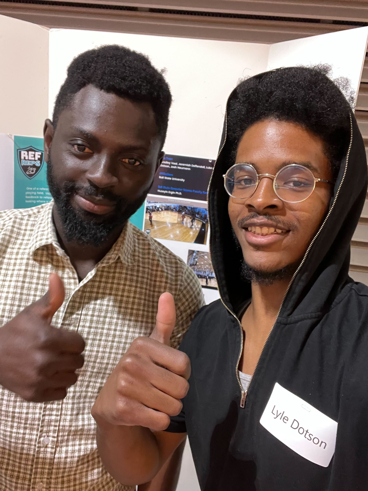
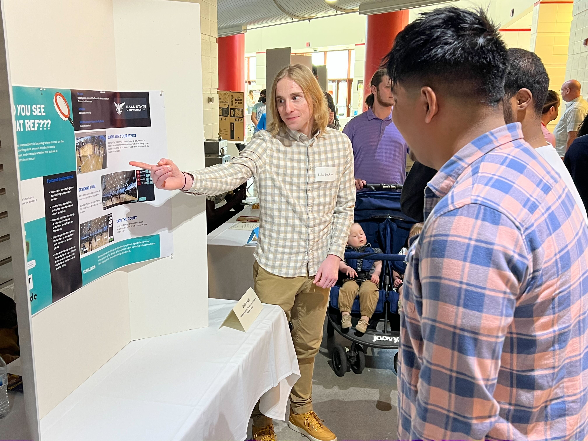
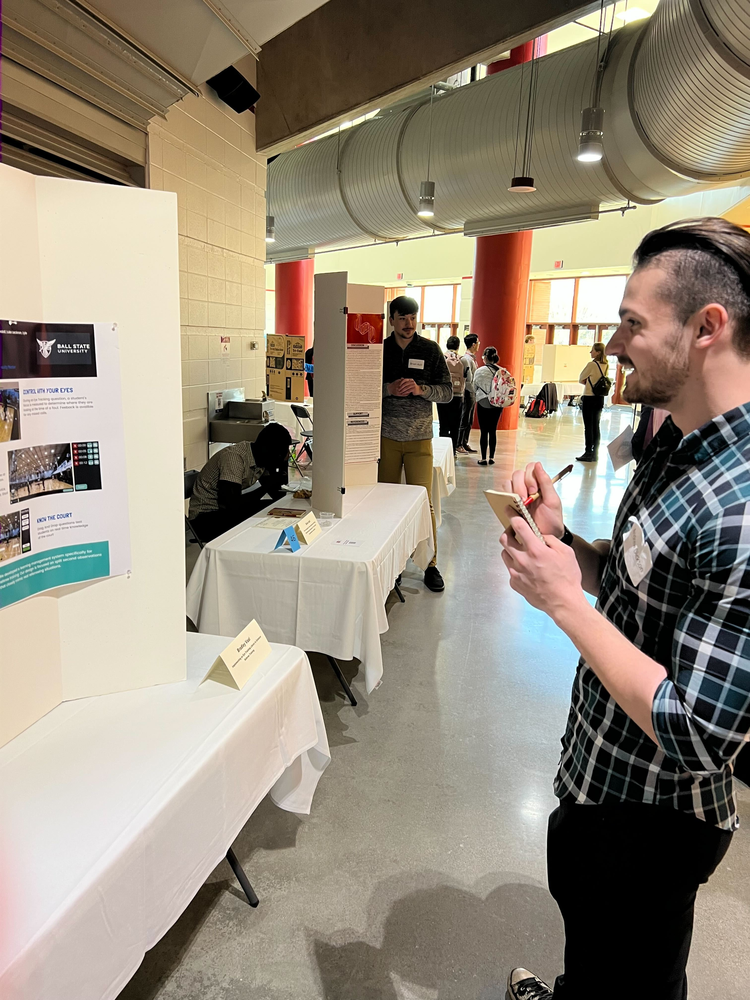

## Team Photo:

## People that listened to us:
(ps: forgot to get their names)

Person 1: 

Person 2: 

Person 3: 

Person 4: 

Person 5:

## Individual Experiences

Bradley
- I enjoyed going to the other Capstone teams and discovering how their projects have come along. It felt nice to see teams that were invested in making great projects. I also enjoyed talking about our project and spreading the word about our great work.

Jeremiah
- I enjoyed my time at the symposium. I really liked seeing all of the other projects around us, and seeing how advanced some of the projects were. It was nice to talk about our project to people who were interested to learn about it. Overall, it was a good experience and I am glad I took part in it.

Luke
- The symposium was a really cool experience. Seeing projects from all different majors and fields was fun to see. Having people come up to us and show genuine interest in our project was nice. I am happy to have had the opportunity to participate. 

Lyle
 - A wonderful experience indeed . I think I enjoyed it not because of the responsibility & professionalism that took place , but I enjoyed it because I was surrounded by mainly other students whom are ready to graduate & are near peeking in their technical experience . I'm glad that I went , there were so many people that I did not expect to run into , and the only reason I did was because of the mix of student majors ; so cool !

Josh
- I really was intrigued by seeing all the dievrse projects and reasearch that was on display at the symposium today and I had a new sense of admiration for our project as well as all the others. Granted, it wasn't the most particularly exciting thing in the world, but I still found myself having a good time, especially when people aked about our project. I was happy to be part of an event such as this one.
